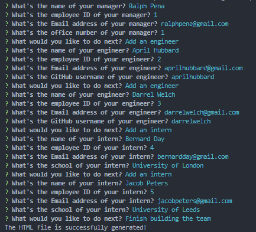
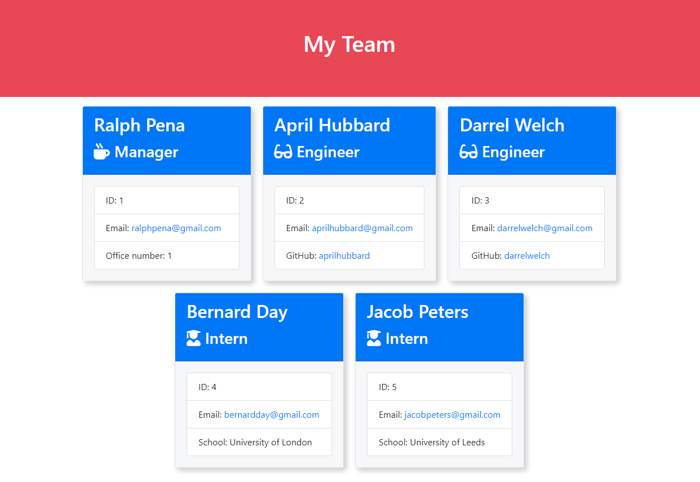
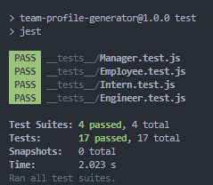

# Team Profile Generator

## Description

The command-line application allows user to quickly and easily generate an HTML file by simply providing essential information about the employees in a team. The HTML shows each team members in a card where user can see their information, send Email to them or view their GitHub repositories. This project uses class and class inheritance to create differnt types of employee such as manager, engineer and intern to helps in reusability of the code. The applicatoin uses [Jest](https://www.npmjs.com/package/jest) for running unit tests and [Inquirer](https://www.npmjs.com/package/inquirer) for collecting input from the user.
<br/>

## Table of Contents

- **[How Does It Work](#how-does-it-work)**
  - [Prompt Questions For User](#prompt-questions-for-user)
  - [Generate HTML File](#generate-file)
  - [Unit Testing](#unit-testing)
- [Installation](#installation)
- [Deployment](#deployment)
- [Authors](#authors)
- [License](#license)
  <br/>

## How Does It Work

### Prompt Questions For User

User needs to run the code below in terminal to start the application.

```
node index.js
```

User is prompted a series of questions about employees of a team in order to write an HTML file and those questions should be answered.


<br />

### Generate File

After answering questions in the terminal, an HTML file is generated inside the output folder.


<br />

### Unit Testing

The application uses [Jest](https://www.npmjs.com/package/jest) for running unit tests to make sure all the manger, engineer and intern class instances will be created correctly.


<br />

## Installation

Download the code <a href="https://github.com/Mingzhao91/team-profile-generator" target="_blank">here</a> and run the following command to generate a README.md file.

```
node index.js
```

<br/>

## Deployment

After providing all employees information in the command line, an HTML file about the team is created inside the output folder. <a href="https://github.com/Mingzhao91/team-profile-generator/blob/main/output/team.html" target="_blank">Here</a> is an example of a generated HTML file.
<br/>

## Authors

- **Mingzhao Zhou** - <a href="https://github.com/Mingzhao91" target="_blank">Mingzhao91</a>
  <br/>

## License

This project is licensed under the MIT License.
